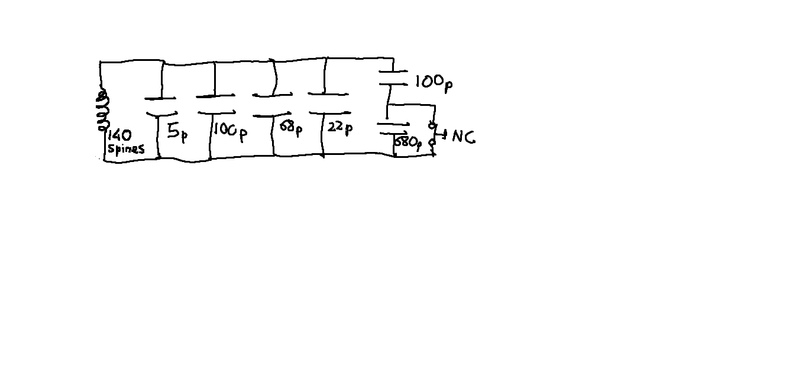
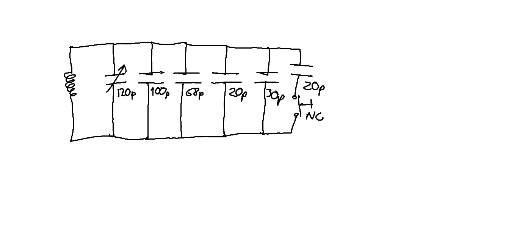

# Sylus with EMR

Designed and tuned to work with Uniball (v1.0) JETSTREAM pens, and XP-PEN Deco mini7 graphics tablet.
Pieces tuned to be mounted on pen.

EDIT: After some iterations I have finally abandoned the project. I managed to make it work, but the
feeling when writing is far from natural. In the first version, in which I used a pusbutton
with a big spring (allowing for a more "natural" sensation when pressing the point of the pen against
paper), the writting was cumbersome and it interrupted if you sligthly decreased the pressure on paper,
so the final result on the digital drawing was not the same as in paper (it was somewhat choppy).

In the second version, I used the components listed below to "optimize" the operation. The capacitors
were supposed to ease the frequency tuning, whereas the pushbutton would give a more "on-off"
feedback sensation when writting, instead of a "continuous" pressure as in V1. These "continuous" feeling,
even when more natural, meant that you didn't know at which threshold the writting was actually digitalized.
However, the feeling was way worse, the pushbutton was way less robust, and the writting was still choppy.
Furthermore I ended spending more time tuning that in the first version. There is a big problem with the
frequency and design as it is: the capacitances required to get the frequency for a reasonable coil are VERY
small (in the order of picofarads). That means that the parasitic capacitance of cables (even between them),
and the relative positioning of components plays a big role in the final capacitance. The tuning process
was quite nightmarish.

In the end, V1 turned to be the best. I used the pen I'd modified (i.e. drilled) for V2, with the very small
cables to connect the coil on the tip with the rest of the circuit running through the interior of the pen,
so the overall aspect was better. And that's it, not a very usable product but at least it serves as proof of
concept and has helped me learn a few things. Check [the final product](Result.md) for reference.

### Principle of working

The pieces created allow to mount an LC tank over the pen. The LC tank is tuned to resonante at the frequency
at which the tablet expects to receive a signal.
- The "base frequency" at which the LC tank is expected to resonate when no buttons are pressed/no point pressure
is detected is about **505 KHz**.
- The frequency at which the LC tank is expected to resonate when the point is pressed is INCREASED. In the original
pen, this is achieved by moving the inner ferrite so that the L of the coil decreases, and thus the frequency slightly
increases. In this pen, a discrete NC pushbutton is pressed when the tip is pressed, and this pushbutton opens a branch
with some capacitance, thus decreasing the total capacitance of the LC tank (see the circuit). The resonant frequency
should be about **515-520** kHz. Note that this is the way the tablet knows that the user is actually "writing" or "drawing" and
not merely positioning the pen.
- The original pen includes some other funcions mapped to other physical buttons, such as right click or double clicking.
When these buttons are pressed, paralel branches are added (i.e. they are no longer in "open circuit") so the total capacitance
is increased and the frequency is reduced. These functions are not implemented in this pen.

### Materials:
- [Cilyndrical ferrite beads (15 mm x 3 diameter):](https://es.aliexpress.com/item/1005003389898844.html)
- [Magnetic copper wire 0.1 mm section:](https://es.aliexpress.com/item/1005005549459084.html)
- [Normally closed NC pushbuttons:](https://es.aliexpress.com/item/32766821112.html)
- Multiple valued capacitors (around 10s-100s pF), or [tunable capacitors](https://es.aliexpress.com/item/1005005699478367.html)

### Notes:

The tablet seems to be very sensitive to capacitors series resistance, since some capacitors work but others of equal value but
different batch or type (i.e. bought from different suppliers) might not work. This is somewhat frustrating. I transitioned to
tunable capacitors to reduce the number of capacitors required.

After much time creating coils with multiple section wires, seems that the optimal wire to do so is the thinnest one (in my case
the 0.1 mm diameter). Probably because in the LC tank that is being created, the dominant resistance is the capacitors one, so
smaller section wires do not really increase noticeabily the resistance (in which power is dissipated). The smallest wires however
allow for a much greater number of spires without broadening too much the resulting coil.

The optimal number of spires has been found to be about 140-160. It theoretically possible to increase the number of spires and
adjust the capacitance to create the resonance at the same frequency, but then the circuit is much more sensitive to capacitor
values: a change of X pF makes the resonant frequency move much more, making the tuning way more complicated. On the other hand,
reducing the number of turns reduces the amount of magnetic flux that the coil "catches" and "radiates" back, making it less sensitive
or even non functional at all.

### Circuit of V1

### Circuit of V2
Same coil used

